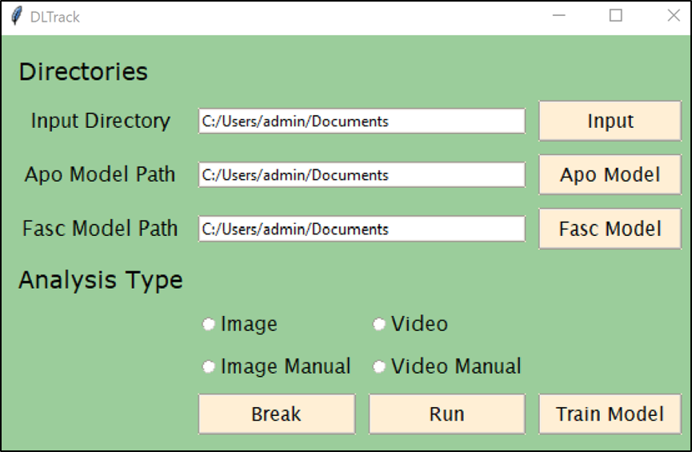
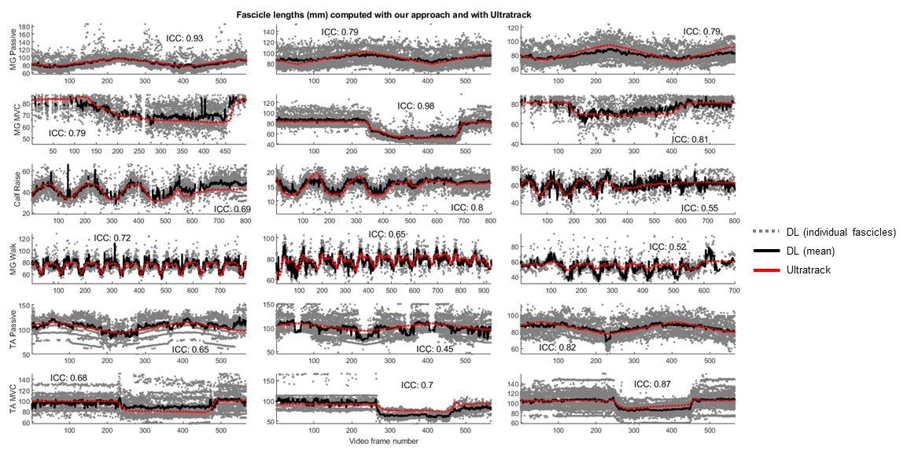

# DL_Track

The DL_Track package provides an easy to use graphical user interface (GUI) for deep learning based analysis of muscle architectural parameters from longitudinal ultrasonography images of human lower limb muscles. Please take a look at our [documentation](https://dltrack.readthedocs.io/en/latest/index.html) for more information.
This code is based on a previously published [algorithm](https://github.com/njcronin/DL_Track) and replaces it. We have extended the functionalities of the previously proposed code. The previous code will not be updated and future updates will be included in this repository. 

## Getting started

For detailled information about installaion of the DL_Track python package we refer you to our [documentation](https://dltrack.readthedocs.io/en/latest/installation.html). There you will finde guidelines not only for the installation procedure of DL_Track, but also concerding conda and GPU setup.

## Quickstart

Once installed, DL_Track can be started from the command prompt with the respective environment activated:

``(DL_Track) C:/User/Desktop/ python -m DL_Track`` 

In case you have downloaded the executable, simply double-click the DL_Track icon.

Regardless of the used method, the GUI should open. For detailed the desciption of our GUI as well as usage examples, please take a look at the [user instruction](https://github.com/PaulRitsche/DLTrack/blob/main/docs/usage/DL_Track_tutorial.pdf). An illustration of out GUI start window is presented below. It is here where users must specify input directories, choose the preferred analysis type, specify the analysis parameters or train thrain their own neural networks based on their own training data. 

## Testing

We have not yet integrated unit testing for DL_Track. Nonetheless, we have provided instructions to objectively test whether DL_Track, once installed, is functionable. To perform the testing procedures yourself, check out the [test instructions](https://github.com/PaulRitsche/DLTrack/blob/main/tests/DL_Track_tests.pdf).

## Code documentation 

In order to see the detailled scope and description of the modules and functions included in the DL_Track package, you can do so either directly in the code, or in the [documentation]([https://dltrack.readthedocs.io/en/latest/modules.html#documentation](https://dltrack.readthedocs.io/en/latest/DL_Track.html#module-DL_Track.DLTrack_GUI) section of our online documentation.

## Previous research

The previously published [algorithm](https://github.com/njcronin/DL_Track) was developed with the aim to compare the performance of the trained deep learning models with manual analysis of muscle fascicle length, muscle fascicle pennation angle and muscle thickness. The results were presented in a published [preprint](https://arxiv.org/pdf/2009.04790.pdf). The results demonstrated in the article described the DL_Track algorithm to be comparable with manual analysis of muscle fascicle length, muscle fascicle pennation angle and muscle thickness in ultrasonography images as well as videos. The results are briefly illustrated in the figures below.

Analysis process from original input image to output result for images of two muscles, gastrocnemius medialis (GM) and vastus lateralis (VL). Subsequent to inputting the original images into the models, predictions are generated by the models for the aponeuroses (apo) and fascicles as displayed in the binary images. Based on the binary image, the output result is calculated by post-processing operations, fascicles and aponeuroses are drawn and the values for fascicle length, pennation angle and muscle thickness are displayed.

Bland-Altman plots of the results obtained with our approach versus the results of manual analyses by the authors (mean of all 3). Results are shown for muscle fascicle length (A), pennation angle (B), and muscle thickness (C). For these plots, only the median fascicle values from the deep learning approach were used, and thickness was computed from the centre of the image. Solid and dotted lines depict bias and 95% limits of agreement, respectively.

A comparison of fascicle lengths computed using DL_Track with those from [UltraTrack](https://sites.google.com/site/ultratracksoftware/home)(Farris & Lichtwark, 2016, DOI:10.1016/j.cmpb.2016.02.016), a semi-automated method of identifying muscle fascicles. Each row shows trials from a particular task (3 examples per task from different individuals, shown in separate columns). For DL_Track, the length of each individual fascicle detected in every frame is denoted by a gray dot. Solid black lines denote the mean length of all detected fascicles by DL_Track. Red dashed lines show the results of tracking a single fascicle with Ultratrack.

## Community guidelines

Wheter you want to contribute, report a bug or have troubles with the DL_Track package, take a look at the provided [instructions](https://dltrack.readthedocs.io/en/latest/contribute.html) how to best do so. You can also contact us via email at paul.ritsche@unibas.ch, but we would prefer you to open a discussion as described in the instructions.
